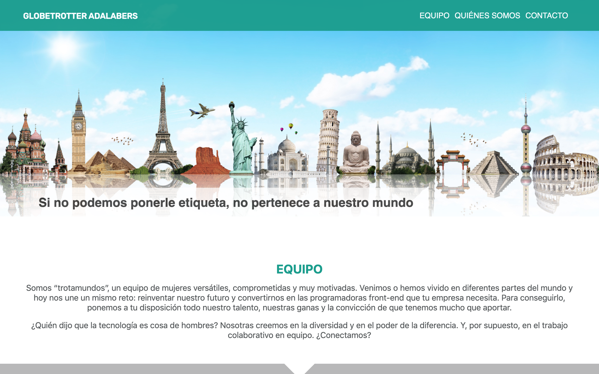

Este proyecto consiste en el **home de una página web estática** y una **página de contacto** con un formulario a la que se accede mediante un enlace, todo ello en **diseño responsive**. El origen de este proyecto es un ejercicio de clase en Adalab desarrollado por cuatro alumnas.

# Estructura

Consta de una **cabecera con un menú de navegación**, un hero con una imagen y un claim que se transparenta, **tres secciones** de contenido: una primera sección sobre nuestras fortalezas, una segunda sección con la presentación del equipo que incluye fotografía, texto e íconos de enlace, y finalmente el **footer** con un menú de navegación con enlaces a distintos puntos de la propia página.
Hemos utilizado **flexbox** para maquetar el header y el main, así como el formulario, mientras que el footer está maquetado con **grid**.
